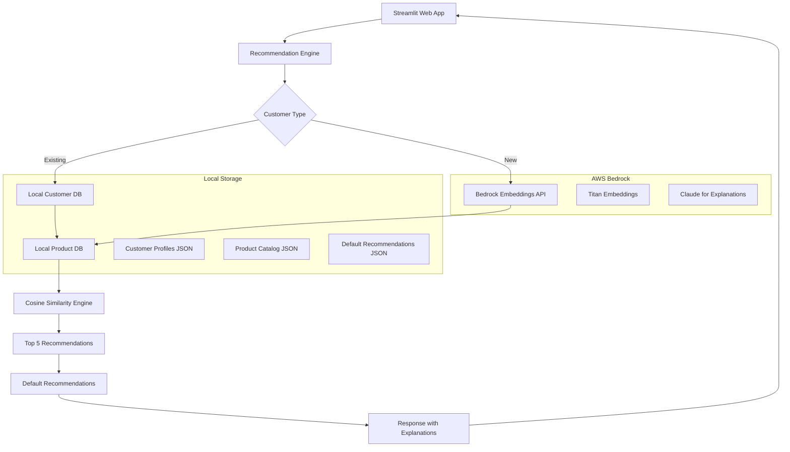

# Bedrock-Based Local Recommendation System - Design Document

## Project Overview

This document outlines the design for a local recommendation system that uses Amazon Bedrock for embeddings generation, stores embeddings for 20 customers locally, and provides a Streamlit web interface for recommendations.

### Goal
Create a local recommendation system that:
- Uses Amazon Bedrock for generating embeddings
- Stores embeddings for 20 customers locally (JSON/SQLite)
- Shows default recommendations for new customers
- Provides an interactive Streamlit web interface
- Runs entirely locally without Lambda or cloud infrastructure

### Key Requirements
- **Input**: Customer ID or new customer profile
- **Output**: Top 5 product recommendations with explanations
- **Scale**: 20 pre-computed customers, unlimited new customers
- **Storage**: Local files (JSON/SQLite) for embeddings and metadata
- **Interface**: Streamlit web application
- **Embeddings**: Amazon Bedrock (Titan Embeddings or Claude)
- **Fallback**: Default recommendations for new customers

## System Architecture

### High-Level Architecture



### Component Overview

1. **Streamlit Web App**: Interactive user interface
2. **Recommendation Engine**: Core logic for generating recommendations
3. **Local Storage**: JSON/SQLite files for customer and product data
4. **Bedrock Integration**: Real-time embedding generation for new customers
5. **Default Recommendation System**: Fallback for new customers
6. **Explanation Generator**: Uses Bedrock to explain recommendations

## Data Model Design

### Local Storage Structure

#### Customer Embeddings (customers.json)
```json
{
  "CUST_001": {
    "customer_id": "CUST_001",
    "embedding_vector": [0.2, 0.8, 0.6, ...],
    "customer_metadata": {
      "name": "John Doe",
      "age": 28,
      "gender": "M",
      "location": "Dubai",
      "preferences": ["Electronics", "Sports"],
      "price_sensitivity": 0.6,
      "signup_date": "2024-01-15"
    },
    "last_updated": "2024-07-24T09:00:00Z"
  }
}
```

#### Product Catalog (products.json)
```json
{
  "PROD_001": {
    "product_id": "PROD_001",
    "product_name": "Wireless Bluetooth Headphones",
    "embedding_vector": [0.3, 0.7, 0.8, ...],
    "product_metadata": {
      "category": "Electronics",
      "subcategory": "Audio",
      "price": 149.99,
      "brand": "TechBrand",
      "rating": 4.5,
      "description": "High-quality wireless headphones with noise cancellation",
      "features": ["Bluetooth 5.0", "30h battery", "Noise cancellation"],
      "in_stock": true
    },
    "last_updated": "2024-07-24T09:00:00Z"
  }
}
```

#### Default Recommendations (defaults.json)
```json
{
  "popular_products": [
    {
      "product_id": "PROD_001",
      "reason": "Most popular item across all customers",
      "category": "Electronics"
    }
  ],
  "category_defaults": {
    "Electronics": ["PROD_001", "PROD_005", "PROD_012"],
    "Clothing": ["PROD_020", "PROD_025", "PROD_030"],
    "Home": ["PROD_040", "PROD_045", "PROD_050"]
  },
  "new_customer_recommendations": [
    {
      "product_id": "PROD_001",
      "product_name": "Wireless Bluetooth Headphones",
      "reason": "Popular choice for new customers",
      "similarity_score": 0.85
    }
  ]
}
```

## Bedrock Integration

### Embedding Generation
- **Model**: Amazon Titan Embeddings G1 - Text
- **Input**: Customer profile text or product description
- **Output**: 1536-dimensional embedding vector
- **Usage**: Real-time generation for new customers

### Text Generation for Explanations
- **Model**: Claude 3 Haiku (cost-effective)
- **Input**: Customer profile + recommended products
- **Output**: Natural language explanations for recommendations
- **Usage**: Generate personalized recommendation explanations

### Sample Bedrock API Calls

#### Generate Customer Embedding
```python
import boto3

bedrock = boto3.client('bedrock-runtime', region_name='us-east-1')

def generate_customer_embedding(customer_profile):
    prompt = f"""
    Customer Profile:
    Age: {customer_profile['age']}
    Gender: {customer_profile['gender']}
    Location: {customer_profile['location']}
    Interests: {', '.join(customer_profile['preferences'])}
    Price Sensitivity: {customer_profile['price_sensitivity']}
    """
    
    response = bedrock.invoke_model(
        modelId='amazon.titan-embed-text-v1',
        body=json.dumps({
            'inputText': prompt
        })
    )
    
    return json.loads(response['body'].read())['embedding']
```

## Streamlit Application Design

### User Interface Components

#### 1. Customer Selection/Input
- Dropdown for existing customers (CUST_001 to CUST_020)
- Form for new customer profile input
- Toggle between "Existing Customer" and "New Customer" modes

#### 2. Recommendation Display
- Cards showing top 5 recommendations
- Product images (placeholder or real)
- Similarity scores
- Detailed explanations
- Product metadata (price, rating, category)

#### 3. Analytics Dashboard
- Customer preference visualization
- Product popularity charts
- Recommendation accuracy metrics

### Page Structure

```python
# streamlit_app.py structure
import streamlit as st

def main():
    st.title("🛍️ AI-Powered Recommendation System")
    
    # Sidebar for customer selection
    with st.sidebar:
        customer_mode = st.radio("Customer Type", ["Existing", "New"])
        
        if customer_mode == "Existing":
            customer_id = st.selectbox("Select Customer", get_customer_list())
        else:
            customer_profile = get_new_customer_form()
    
    # Main content area
    col1, col2 = st.columns([2, 1])
    
    with col1:
        st.subheader("🎯 Recommendations for You")
        recommendations = get_recommendations(customer_id or customer_profile)
        display_recommendations(recommendations)
    
    with col2:
        st.subheader("📊 Your Profile")
        display_customer_profile(customer_id or customer_profile)
        
        st.subheader("🔍 Why These Products?")
        display_explanations(recommendations)
```

## Recommendation Algorithm

### For Existing Customers (20 pre-computed)
1. Load customer embedding from local storage
2. Calculate cosine similarity with all products
3. Sort by similarity score
4. Return top 5 products
5. Generate explanations using Bedrock

### For New Customers
1. Collect customer profile from Streamlit form
2. Generate embedding using Bedrock Titan
3. Calculate similarity with product embeddings
4. If similarity scores are low, fall back to default recommendations
5. Generate personalized explanations using Claude

### Similarity Calculation
```python
import numpy as np
from sklearn.metrics.pairwise import cosine_similarity

def calculate_recommendations(customer_embedding, product_embeddings, top_k=5):
    similarities = cosine_similarity(
        [customer_embedding], 
        list(product_embeddings.values())
    )[0]
    
    # Get top-k product indices
    top_indices = np.argsort(similarities)[::-1][:top_k]
    
    recommendations = []
    for idx in top_indices:
        product_id = list(product_embeddings.keys())[idx]
        recommendations.append({
            'product_id': product_id,
            'similarity_score': similarities[idx]
        })
    
    return recommendations
```

## Default Recommendation Strategy

### Fallback Scenarios
1. **New customer with low similarity scores**: Show popular products
2. **Empty preferences**: Show category-based defaults
3. **System errors**: Show curated "staff picks"

### Default Categories
- **Popular Items**: Top-rated products across all categories
- **New Arrivals**: Recently added products
- **Seasonal Picks**: Season-appropriate recommendations
- **Budget-Friendly**: Lower-priced options
- **Premium Selection**: High-end products

## File Structure

```
bedrock-streamlit-recommendation/
├── README.md
├── requirements.txt
├── streamlit_app.py                 # Main Streamlit application
├── recommendation_engine.py         # Core recommendation logic
├── bedrock_client.py               # Bedrock API integration
├── data_manager.py                 # Local data management
├── config.py                       # Configuration settings
├── data/
│   ├── customers.json              # 20 customer embeddings
│   ├── products.json               # Product catalog with embeddings
│   ├── defaults.json               # Default recommendations
│   └── customer_images/            # Customer profile images
├── assets/
│   ├── product_images/             # Product images
│   └── logos/                      # Brand logos
├── utils/
│   ├── embedding_generator.py      # Embedding utilities
│   ├── similarity_calculator.py    # Similarity calculations
│   └── explanation_generator.py    # Recommendation explanations
├── scripts/
│   ├── generate_initial_data.py    # Generate 20 customers + products
│   ├── update_embeddings.py        # Refresh embeddings
│   └── test_bedrock_connection.py  # Test Bedrock connectivity
└── tests/
    ├── test_recommendations.py     # Unit tests
    ├── test_bedrock_integration.py # Bedrock API tests
    └── test_streamlit_app.py       # UI tests
```

## Implementation Phases

### Phase 1: Core Infrastructure
- Set up Bedrock client and authentication
- Create local data storage structure
- Implement basic recommendation engine
- Generate initial 20 customer profiles

### Phase 2: Streamlit Application
- Build main Streamlit interface
- Implement customer selection/input forms
- Create recommendation display components
- Add basic styling and layout

### Phase 3: Bedrock Integration
- Integrate Titan Embeddings for new customers
- Add Claude for recommendation explanations
- Implement error handling and fallbacks
- Add caching for API calls

### Phase 4: Enhancement & Testing
- Add analytics dashboard
- Implement recommendation explanations
- Performance optimization
- Comprehensive testing

## Configuration Requirements

### Environment Variables
```bash
# AWS Bedrock Configuration
AWS_REGION=us-east-1
AWS_ACCESS_KEY_ID=your_access_key
AWS_SECRET_ACCESS_KEY=your_secret_key

# Bedrock Models
EMBEDDING_MODEL_ID=amazon.titan-embed-text-v1
TEXT_MODEL_ID=anthropic.claude-3-haiku-20240307-v1:0

# Application Settings
MAX_RECOMMENDATIONS=5
SIMILARITY_THRESHOLD=0.3
DEFAULT_FALLBACK_COUNT=5
CACHE_EMBEDDINGS=true
```

### AWS Permissions Required
```json
{
    "Version": "2012-10-17",
    "Statement": [
        {
            "Effect": "Allow",
            "Action": [
                "bedrock:InvokeModel"
            ],
            "Resource": [
                "arn:aws:bedrock:*::foundation-model/amazon.titan-embed-text-v1",
                "arn:aws:bedrock:*::foundation-model/anthropic.claude-3-haiku-20240307-v1:0"
            ]
        }
    ]
}
```

## Success Criteria

### Functional Requirements
- ✅ Generate recommendations for 20 pre-computed customers
- ✅ Handle new customer profiles with real-time embedding generation
- ✅ Provide default recommendations when similarity is low
- ✅ Display recommendations in an intuitive Streamlit interface
- ✅ Generate explanations for recommendations

### Performance Requirements
- ✅ Response time under 3 seconds for existing customers
- ✅ Response time under 10 seconds for new customers (including Bedrock calls)
- ✅ Handle concurrent users (Streamlit's built-in capabilities)

### Quality Requirements
- ✅ Recommendations are relevant and diverse
- ✅ Explanations are clear and personalized
- ✅ System gracefully handles errors and API failures
- ✅ Code is maintainable and well-documented

## Cost Estimation

### AWS Bedrock Costs (Monthly)
- **Titan Embeddings**: ~$0.10 per 1M tokens (customer profiles ~100 tokens each)
- **Claude 3 Haiku**: ~$0.25 per 1M input tokens (explanations ~200 tokens each)
- **Estimated Monthly Cost**: $5-15 for moderate usage (100 new customers/day)

### Local Infrastructure
- **Compute**: Runs on local machine (no additional cost)
- **Storage**: Minimal (< 100MB for all data)
- **Total Local Cost**: $0

---

*This design document serves as the blueprint for implementing the Bedrock-based local recommendation system with Streamlit interface.*