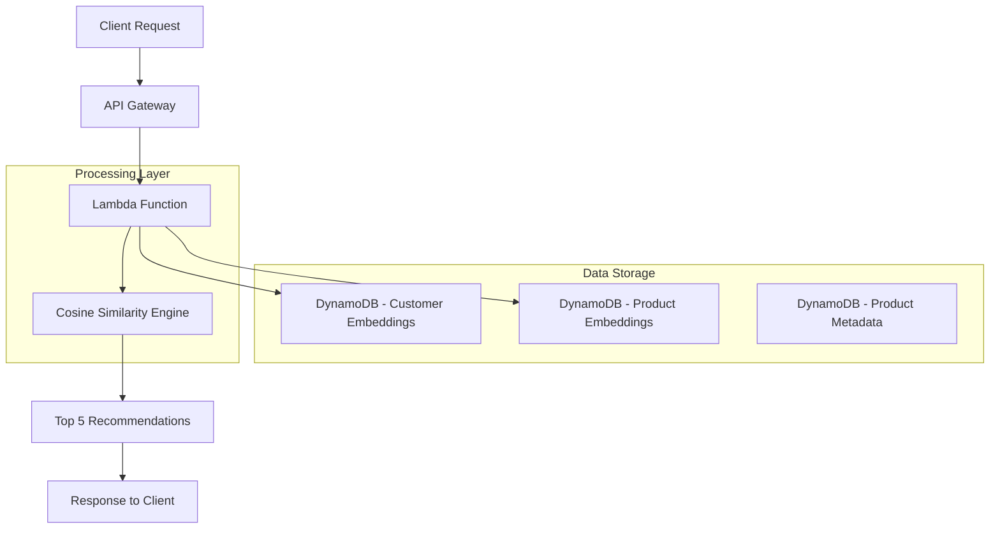
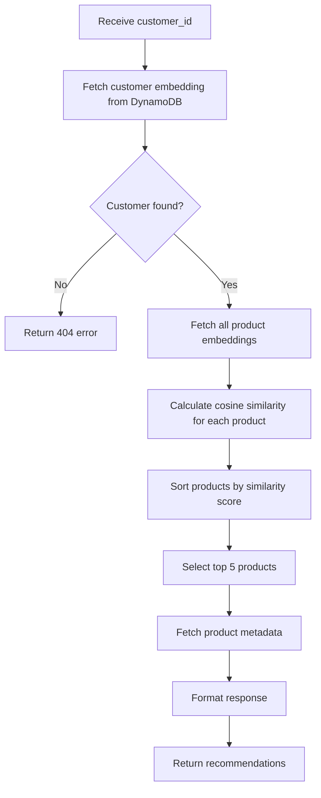
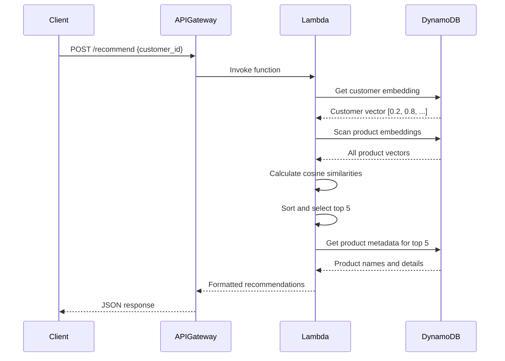

# Vector-Based Recommendation Engine POC - Design Document

## Project Overview

This document outlines the design for a Proof of Concept (POC) vector-based recommendation engine that provides product recommendations based on customer preferences using AWS Lambda and DynamoDB.

### Goal
Create a simple vector-based recommendation engine that returns `product_id` and `product_name` based on a provided `customer_id`.

### Key Requirements
- **Input**: Customer ID
- **Output**: Top 5 product recommendations (product_id, product_name)
- **Scale**: 100-1000 customers, 500-2000 products
- **Performance**: Response time under 2 seconds
- **Data**: Synthetic/mock data for POC
- **Algorithm**: Cosine similarity for recommendation matching
- **Storage**: DynamoDB for embeddings and metadata

## System Architecture

### High-Level Architecture



### Component Overview

1. **API Gateway**: Entry point for HTTP requests
2. **Lambda Function**: Core recommendation logic
3. **DynamoDB Tables**: Storage for embeddings and metadata
4. **Cosine Similarity Engine**: Algorithm for finding similar products

## Data Model Design

### Vector Embedding Structure

#### Customer Embedding Vector
Based on customer demographics and preferences:
- **Dimensions**: 10-dimensional vector
- **Components**:
  - Age group preference (normalized 0-1)
  - Gender preference weight (0-1)
  - Price sensitivity (0-1, where 0=budget, 1=premium)
  - Category preferences (5 dimensions for top categories)
  - Brand loyalty factor (0-1)
  - Seasonal preference (0-1)

#### Product Embedding Vector
Based on product characteristics:
- **Dimensions**: 10-dimensional vector
- **Components**:
  - Target age group (normalized 0-1)
  - Gender target (0-1)
  - Price tier (normalized 0-1)
  - Category encoding (5 dimensions)
  - Brand prestige score (0-1)
  - Seasonal relevance (0-1)

### DynamoDB Schema Design

#### Table 1: CustomerEmbeddings
```json
{
  "TableName": "CustomerEmbeddings",
  "KeySchema": [
    {
      "AttributeName": "customer_id",
      "KeyType": "HASH"
    }
  ],
  "AttributeDefinitions": [
    {
      "AttributeName": "customer_id",
      "AttributeType": "S"
    }
  ],
  "BillingMode": "PAY_PER_REQUEST"
}
```

**Item Structure:**
```json
{
  "customer_id": "CUST_001",
  "embedding_vector": [0.2, 0.8, 0.6, 0.9, 0.1, 0.7, 0.3, 0.5, 0.8, 0.4],
  "customer_metadata": {
    "age": 28,
    "gender": "F",
    "location": "Dubai",
    "signup_date": "2024-01-15"
  },
  "last_updated": "2024-07-24T07:55:00Z"
}
```

#### Table 2: ProductEmbeddings
```json
{
  "TableName": "ProductEmbeddings",
  "KeySchema": [
    {
      "AttributeName": "product_id",
      "KeyType": "HASH"
    }
  ],
  "AttributeDefinitions": [
    {
      "AttributeName": "product_id",
      "AttributeType": "S"
    }
  ],
  "BillingMode": "PAY_PER_REQUEST"
}
```

**Item Structure:**
```json
{
  "product_id": "PROD_001",
  "product_name": "Wireless Bluetooth Headphones",
  "embedding_vector": [0.3, 0.7, 0.8, 0.6, 0.2, 0.9, 0.4, 0.5, 0.7, 0.6],
  "product_metadata": {
    "category": "Electronics",
    "subcategory": "Audio",
    "price": 149.99,
    "brand": "TechBrand",
    "rating": 4.5,
    "in_stock": true
  },
  "last_updated": "2024-07-24T07:55:00Z"
}
```

## Lambda Function Architecture

### Function Specification
- **Runtime**: Python 3.9+
- **Memory**: 512 MB
- **Timeout**: 30 seconds
- **Environment Variables**:
  - `CUSTOMER_EMBEDDINGS_TABLE`
  - `PRODUCT_EMBEDDINGS_TABLE`
  - `AWS_REGION`

### API Specification

#### Request Format
```json
{
  "httpMethod": "POST",
  "path": "/recommend",
  "body": {
    "customer_id": "CUST_001"
  }
}
```

#### Response Format
```json
{
  "statusCode": 200,
  "body": {
    "customer_id": "CUST_001",
    "recommendations": [
      {
        "product_id": "PROD_123",
        "product_name": "Wireless Bluetooth Headphones",
        "similarity_score": 0.95
      },
      {
        "product_id": "PROD_456",
        "product_name": "Smart Fitness Watch",
        "similarity_score": 0.89
      },
      {
        "product_id": "PROD_789",
        "product_name": "Portable Phone Charger",
        "similarity_score": 0.87
      },
      {
        "product_id": "PROD_012",
        "product_name": "Bluetooth Speaker",
        "similarity_score": 0.85
      },
      {
        "product_id": "PROD_345",
        "product_name": "Wireless Mouse",
        "similarity_score": 0.82
      }
    ],
    "processing_time_ms": 1250
  }
}
```

#### Error Response Format
```json
{
  "statusCode": 404,
  "body": {
    "error": "Customer not found",
    "customer_id": "CUST_999",
    "message": "No embedding found for the provided customer ID"
  }
}
```

## Algorithm Implementation

### Cosine Similarity Calculation

The recommendation engine uses cosine similarity to find products most similar to customer preferences:

```python
import numpy as np

def cosine_similarity(vector_a, vector_b):
    """
    Calculate cosine similarity between two vectors
    Returns value between -1 and 1, where 1 means identical
    """
    dot_product = np.dot(vector_a, vector_b)
    norm_a = np.linalg.norm(vector_a)
    norm_b = np.linalg.norm(vector_b)
    
    if norm_a == 0 or norm_b == 0:
        return 0
    
    return dot_product / (norm_a * norm_b)
```

### Recommendation Process Flow



## Data Flow Diagrams

### Request Processing Flow



## Synthetic Data Generation Strategy

### Customer Data Generation
- **Customer IDs**: CUST_001 to CUST_1000
- **Demographics**: Random age (18-65), gender, location
- **Preference Vectors**: Generated using normal distribution with category biases
- **Sample Categories**: Electronics, Clothing, Home & Garden, Sports, Books

### Product Data Generation
- **Product IDs**: PROD_001 to PROD_2000
- **Categories**: 5 main categories with 3-5 subcategories each
- **Price Range**: $10 - $500 with category-appropriate distributions
- **Embedding Generation**: Based on category, price tier, and target demographics

### Sample Data Sets

#### Customer Profiles
```python
customer_profiles = [
    {
        "customer_id": "CUST_001",
        "age": 28,
        "gender": "F",
        "preferences": ["Electronics", "Fashion"],
        "price_sensitivity": 0.6
    },
    {
        "customer_id": "CUST_002", 
        "age": 35,
        "gender": "M",
        "preferences": ["Sports", "Electronics"],
        "price_sensitivity": 0.3
    }
]
```

#### Product Catalog
```python
product_catalog = [
    {
        "product_id": "PROD_001",
        "name": "Wireless Bluetooth Headphones",
        "category": "Electronics",
        "subcategory": "Audio",
        "price": 149.99,
        "target_age": "18-40",
        "target_gender": "Unisex"
    },
    {
        "product_id": "PROD_002",
        "name": "Running Shoes",
        "category": "Sports",
        "subcategory": "Footwear", 
        "price": 89.99,
        "target_age": "20-50",
        "target_gender": "Unisex"
    }
]
```

## Error Handling Strategy

### Error Types and Responses

1. **Customer Not Found (404)**
   - When customer_id doesn't exist in CustomerEmbeddings table
   - Return structured error with customer_id for debugging

2. **Invalid Request Format (400)**
   - Missing customer_id in request body
   - Invalid JSON format
   - Return validation error details

3. **DynamoDB Service Errors (500)**
   - Connection timeouts
   - Throttling errors
   - Return generic service error message

4. **Processing Errors (500)**
   - Vector calculation failures
   - Data corruption issues
   - Return processing error with request ID

### Monitoring and Logging

- **CloudWatch Logs**: All function executions
- **CloudWatch Metrics**: 
  - Request count
  - Error rate
  - Response time
  - DynamoDB read/write metrics
- **X-Ray Tracing**: End-to-end request tracing

## Infrastructure Requirements

### AWS Services
- **Lambda Function**: 512MB memory, 30s timeout
- **DynamoDB**: 2 tables with on-demand billing
- **API Gateway**: REST API with CORS enabled
- **CloudWatch**: Logging and monitoring
- **IAM Roles**: Lambda execution role with DynamoDB permissions

### Estimated Costs (Monthly)
- **Lambda**: ~$5-10 (based on 10,000 requests/month)
- **DynamoDB**: ~$2-5 (based on data size and read/write patterns)
- **API Gateway**: ~$3-7 (based on request volume)
- **Total**: ~$10-22/month for POC scale

## Testing Strategy

### Unit Testing
- Vector similarity calculations
- Data validation functions
- Error handling scenarios

### Integration Testing
- End-to-end API testing
- DynamoDB integration
- Performance testing with sample data

### Load Testing
- Simulate 100 concurrent requests
- Measure response times under load
- Validate 2-second response time requirement

### Validation Approach
- Manual verification of recommendations
- A/B testing with different similarity thresholds
- Monitoring recommendation diversity and relevance

## Implementation Phases

### Phase 1: Core Infrastructure
- Set up DynamoDB tables
- Create basic Lambda function
- Implement cosine similarity algorithm

### Phase 2: Data Population
- Generate synthetic customer data
- Generate synthetic product catalog
- Populate DynamoDB tables

### Phase 3: API Development
- Implement recommendation logic
- Add error handling
- Create API Gateway integration

### Phase 4: Testing & Optimization
- Performance testing
- Error scenario testing
- Response time optimization

## Success Criteria

1. **Functional Requirements**
   - ✅ Returns top 5 product recommendations for valid customer_id
   - ✅ Response includes product_id and product_name
   - ✅ Handles invalid customer_id gracefully

2. **Performance Requirements**
   - ✅ Response time under 2 seconds
   - ✅ Supports 100-1000 customers
   - ✅ Handles 500-2000 products

3. **Quality Requirements**
   - ✅ Recommendations are relevant and diverse
   - ✅ System is reliable and handles errors gracefully
   - ✅ Code is maintainable and well-documented

## Next Steps

After design approval, the implementation should follow this sequence:
1. Set up AWS infrastructure
2. Implement Lambda function core logic
3. Create and populate DynamoDB tables
4. Integrate API Gateway
5. Generate synthetic data
6. Perform testing and validation
7. Deploy and monitor

---

*This design document serves as the blueprint for implementing the vector-based recommendation engine POC. All components are designed to be simple, scalable, and cost-effective for demonstration purposes.*