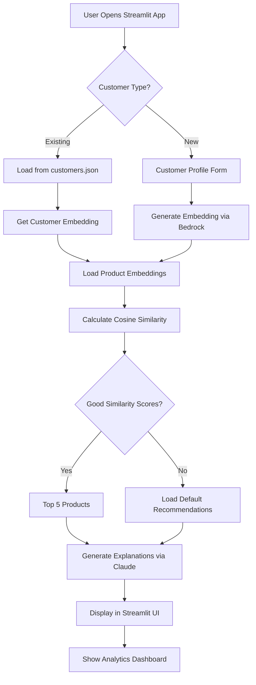

# Dual Recommendation Systems Project Plan

## Overview

This project will create two distinct recommendation systems:

1. **Existing Lambda-based System**: Serverless recommendation engine using AWS Lambda, DynamoDB, and API Gateway
2. **New Bedrock-Streamlit System**: Local recommendation system using Amazon Bedrock for embeddings and Streamlit for the web interface

## Project Requirements Summary

### Bedrock-Streamlit System Specifications
- **Embeddings**: Amazon Titan Embeddings G1 - Text
- **Explanations**: Claude 3 Haiku for recommendation explanations
- **Products**: E-commerce (electronics, clothing, home goods)
- **Customers**: 20 pre-computed customers with diverse UAE demographics (age 18-65)
- **Interface**: Streamlit web application
- **Storage**: Local JSON files (no cloud infrastructure)
- **New Customers**: Real-time embedding generation with default fallbacks

### Repository Organization
```
s3-vector-lambda/
├── README.md                                    # Updated main README
├── project-plan.md                             # This file
├── bedrock-streamlit-recommendation-design.md  # Design document
├── lambda-recommendation-engine/               # Existing Lambda system
│   ├── README.md
│   ├── lambda_function.py
│   ├── requirements.txt
│   ├── template.yaml
│   ├── vector-recommendation-engine-design.md
│   ├── infrastructure/
│   │   └── dynamodb-tables.yaml
│   ├── scripts/
│   │   ├── deploy-lambda.sh
│   │   ├── deploy-tables.sh
│   │   └── generate_synthetic_data.py
│   └── tests/
│       └── test_recommendation_engine.py
└── bedrock-streamlit-recommendation/           # New Bedrock system
    ├── README.md
    ├── requirements.txt
    ├── streamlit_app.py
    ├── recommendation_engine.py
    ├── bedrock_client.py
    ├── data_manager.py
    ├── config.py
    ├── data/
    │   ├── customers.json
    │   ├── products.json
    │   ├── defaults.json
    │   └── customer_images/
    ├── assets/
    │   ├── product_images/
    │   └── logos/
    ├── utils/
    │   ├── embedding_generator.py
    │   ├── similarity_calculator.py
    │   └── explanation_generator.py
    ├── scripts/
    │   ├── generate_initial_data.py
    │   ├── update_embeddings.py
    │   └── test_bedrock_connection.py
    └── tests/
        ├── test_recommendations.py
        ├── test_bedrock_integration.py
        └── test_streamlit_app.py
```

## Implementation Phases

### Phase 1: Repository Reorganization (Day 1)
**Goal**: Clean up and organize the existing codebase

**Tasks**:
1. Create new folder structure
2. Move existing Lambda files to `lambda-recommendation-engine/`
3. Create `bedrock-streamlit-recommendation/` folder structure
4. Update documentation and README files

**Deliverables**:
- Organized repository structure
- Updated README files
- Clear separation of systems

### Phase 2: Data Generation and Storage (Day 2-3)
**Goal**: Create local data storage and generate initial datasets

**Tasks**:
1. Design 20 diverse customer profiles for UAE demographics
2. Create comprehensive product catalog (electronics, clothing, home goods)
3. Set up local JSON storage system
4. Generate default recommendations for new customers

**Deliverables**:
- 20 customer profiles with metadata
- 200+ product catalog with descriptions
- Default recommendation sets
- Local data management system

### Phase 3: Bedrock Integration (Day 4-5)
**Goal**: Implement Amazon Bedrock integration for embeddings and explanations

**Tasks**:
1. Set up Bedrock client configuration
2. Implement Titan Embeddings G1 - Text integration
3. Generate embeddings for all customers and products
4. Integrate Claude 3 Haiku for explanations
5. Add error handling and fallback mechanisms

**Deliverables**:
- Working Bedrock client
- Generated embeddings for all data
- Explanation generation system
- Robust error handling

### Phase 4: Core Recommendation Engine (Day 6-7)
**Goal**: Build the recommendation logic and similarity calculations

**Tasks**:
1. Implement cosine similarity calculations
2. Create recommendation engine for existing customers
3. Build real-time embedding generation for new customers
4. Implement default recommendation fallbacks
5. Add recommendation explanation generation

**Deliverables**:
- Core recommendation engine
- Similarity calculation system
- New customer handling
- Explanation generation

### Phase 5: Streamlit Application (Day 8-10)
**Goal**: Create the web interface and user experience

**Tasks**:
1. Build main Streamlit application structure
2. Create customer selection and input forms
3. Implement recommendation display with product cards
4. Add analytics dashboard
5. Implement responsive design and styling

**Deliverables**:
- Complete Streamlit web application
- Intuitive user interface
- Analytics and insights
- Professional styling

### Phase 6: Testing and Documentation (Day 11-12)
**Goal**: Ensure system reliability and provide comprehensive documentation

**Tasks**:
1. Create comprehensive testing suite
2. Test Bedrock integration and error scenarios
3. Performance testing and optimization
4. Write setup and usage documentation
5. Create demo scenarios and examples

**Deliverables**:
- Complete test suite
- Performance benchmarks
- Setup documentation
- User guide and examples

## Technical Architecture

### Bedrock-Streamlit System Flow



### Key Components

#### 1. Bedrock Client (`bedrock_client.py`)
- Handles AWS Bedrock authentication
- Manages Titan Embeddings API calls
- Integrates Claude 3 Haiku for explanations
- Implements retry logic and error handling

#### 2. Recommendation Engine (`recommendation_engine.py`)
- Core similarity calculations
- Customer and product matching
- Default recommendation logic
- Performance optimization

#### 3. Data Manager (`data_manager.py`)
- Local JSON file operations
- Data validation and integrity
- Caching mechanisms
- Data update utilities

#### 4. Streamlit App (`streamlit_app.py`)
- User interface components
- Interactive forms and displays
- Real-time recommendation updates
- Analytics visualizations

## Success Metrics

### Functional Requirements
- ✅ Handle 20 pre-computed customers with instant recommendations
- ✅ Generate real-time recommendations for new customers
- ✅ Provide meaningful default recommendations
- ✅ Generate natural language explanations
- ✅ Intuitive Streamlit interface

### Performance Requirements
- ✅ < 1 second response for existing customers
- ✅ < 10 seconds response for new customers (including Bedrock calls)
- ✅ Handle multiple concurrent users
- ✅ Graceful error handling and fallbacks

### Quality Requirements
- ✅ Relevant and diverse recommendations
- ✅ Clear and personalized explanations
- ✅ Professional user interface
- ✅ Comprehensive documentation
- ✅ Robust testing coverage

## Cost Estimation

### AWS Bedrock Costs
- **Titan Embeddings**: ~$0.0001 per 1K tokens
- **Claude 3 Haiku**: ~$0.00025 per 1K input tokens, ~$0.00125 per 1K output tokens
- **Monthly Estimate**: $5-15 for moderate usage (50 new customers/day)

### Development Resources
- **Timeline**: 12 days for complete implementation
- **Infrastructure**: Local development machine
- **Dependencies**: Python, Streamlit, AWS SDK, NumPy, Pandas

## Risk Mitigation

### Technical Risks
1. **Bedrock API Limits**: Implement caching and rate limiting
2. **Embedding Quality**: Test with diverse customer profiles
3. **Performance Issues**: Optimize similarity calculations
4. **Data Consistency**: Implement validation and backup systems

### Operational Risks
1. **AWS Costs**: Monitor usage and implement cost alerts
2. **Data Privacy**: Ensure local storage security
3. **User Experience**: Conduct usability testing
4. **Maintenance**: Create update and backup procedures

## Next Steps

1. **Review and Approve Plan**: Confirm all requirements and specifications
2. **Set Up Development Environment**: Install dependencies and configure AWS access
3. **Begin Phase 1**: Start with repository reorganization
4. **Regular Check-ins**: Daily progress reviews and adjustments

This plan provides a comprehensive roadmap for creating both systems while maintaining the existing Lambda-based solution and adding the new Bedrock-powered local recommendation system.